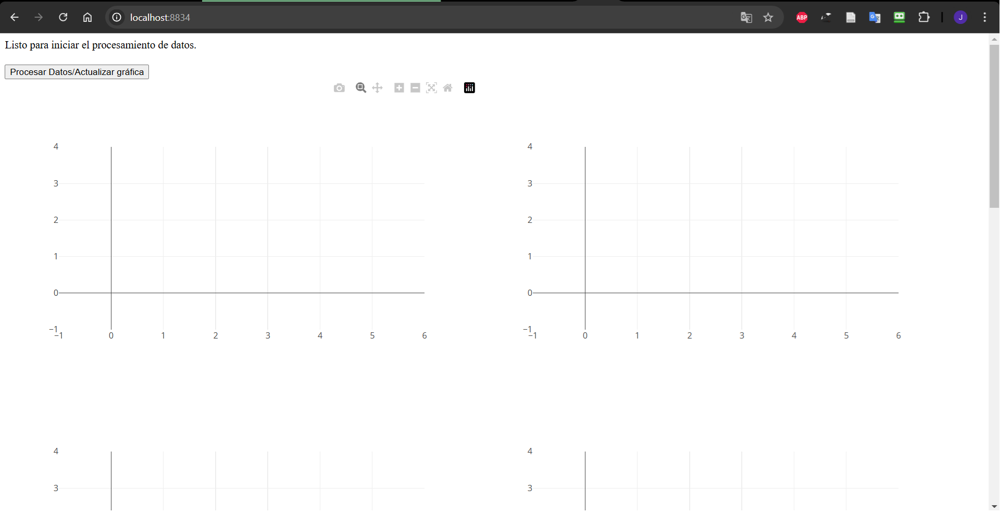
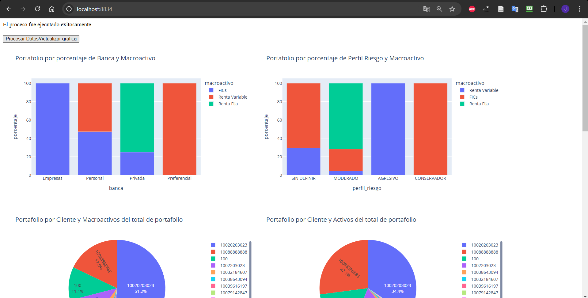
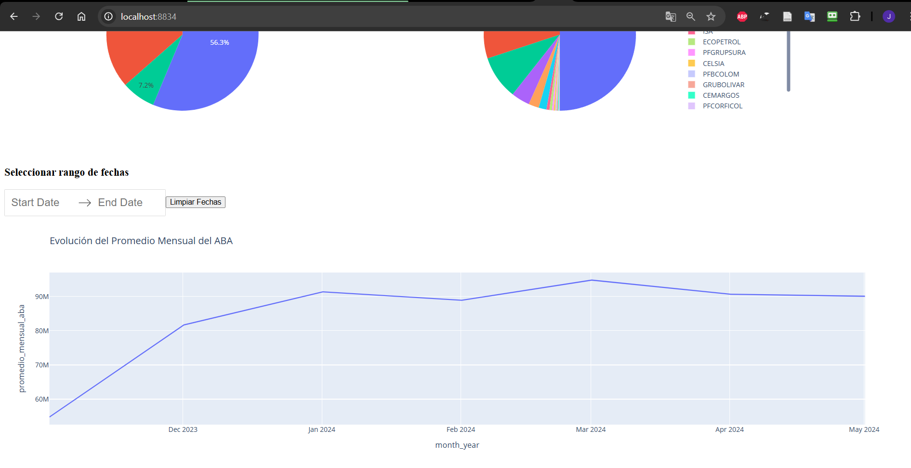
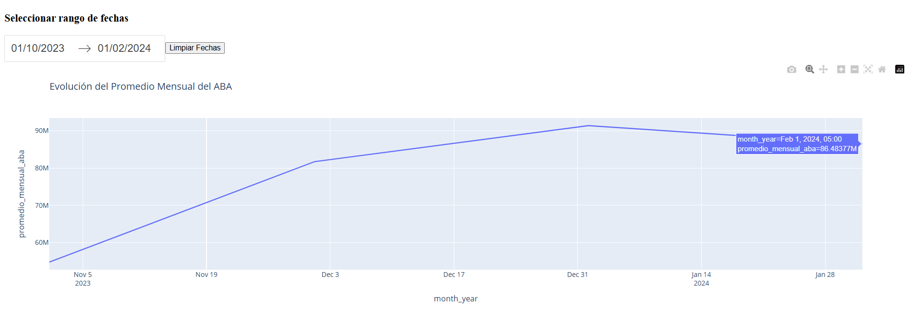

# Proyecto de Ingeniería de Datos

Este proyecto tiene como objetivo desarrollar un sistema de análisis de datos para gerentes comerciales de inversión. Proporciona herramientas analíticas para visualizar el portafolio de clientes, la evolución del ABA y más. La aplicación está construida con Dash, utilizando Flask como servidor, extrae la información desde archivos planos CSV y almacena los datos en una base de datos PostgreSQL.

## Contenidos
- [Requisitos Previos](#requisitos-previos)
- [Instalación](#instalación)
- [Configuración](#configuración)
- [Ejecución](#ejecución)
- [Imágenes de Ejemplo](#imágenes-de-ejemplo)

## Requisitos Previos

Antes de comenzar, asegúrate de tener instalado lo siguiente en tu máquina local:
- Docker
- Docker Compose

## Instalación

1. **Clonar el repositorio**:
   ```bash
   git clone https://github.com/juliozapatao96/etl-docker-tb-1.git
   ```

## Configuración

1. **Crear y activar la base de datos**:
   La base de datos `portafolio_inversiones` se creará automáticamente al iniciar el contenedor de PostgreSQL.


2. **Configurar el directorio de datos**:

   Crea los directorios `data` y `config` dentro de `etl-docker-tb-1`. Adicionalmente, dentro de `data` debe crear dos carpetas: `input-data` y `historical-data`. Al nivel de la carpeta `data`, deben quedar los archivos CSVs de configuración iniciales, y dentro de `input-data` debe transferir los archivos `historico_aba_macroactivos-string.csv`.
   

 ```plaintext
   etl-docker-tb-1/
   ├── src/
   ├── config/
   └── data/
      ├── input-data/
      └── historical-data/
   ...
 ```

3. **Actualizar variables de entorno en `config.env`**:

   Configura las credenciales de la base de datos en el archivo `config.env` que debe crearse en el directorio principal del proyecto dentro de la carpeta `config`:
   ```bash
   DB_NAME=tu_base_de_datos
   DB_USERNAME=tu_usuario_postgres
   DB_PASSWORD=tu_contraseña_postgres
   DB_HOST=db
   DB_PORT=5432
   ```

   Adicionalmente, dentro de la carpeta del proyecto debe crear el archivo `.env` que contiene las variables de entorno que tomará Docker al inicializar los contenedores.
   ```bash
   POSTGRES_DB=tu_base_de_datos
   POSTGRES_USER=tu_usuario_postgres
   POSTGRES_PASSWORD=tu_contraseña_postgres
   PGADMIN_DEFAULT_EMAIL=tu_email_pgadmin
   PGADMIN_DEFAULT_PASSWORD=tu_usuario_pgadmin
   ```

## Ejecución

1. **Iniciar los contenedores**:
   Para iniciar la aplicación y la base de datos en Docker, ejecuta el siguiente comando en la terminal:
   ```bash
   docker-compose up -d

2. **Acceder a la aplicación**:
   Finalmente, en un navegador abre la aplicación con:
   ```bash
   http://localhost:8833/
   ```

   Dentro de la carpeta `input-data` debe agregar los archivos que la aplicación debe procesar, y posteriormente dar clic en el botón que se ubica en la zona superior izquierda llamado 'Procesar Datos/Actualizar Gráfica'. Debe presionar este botón cada vez que agregue un nuevo archivo a procesar en esta carpeta.

   Por otra parte, es posible seleccionar o deseleccionar (con el botón 'Limpiar Fechas') un rango de fechas para analizar un periodo en específico para la gráfica 'Evolución del Promedio Mensual del ABA' y finalmente, dar clic en el botón indicado anteriormente.

3. **Acceder a pgAdmin (opcional)**: Puedes acceder a él en:
   ```bash
   http://localhost:8080/

## Imágenes de Ejemplo

A continuación se presentan algunas capturas de pantalla del dashboard:


*Iniciando el Dashboard*


*Procesamiento de datos ejecutado*


*Gráfica sin rango de fechas aplicado*


*Gráfica con rango de fechas aplicado*
