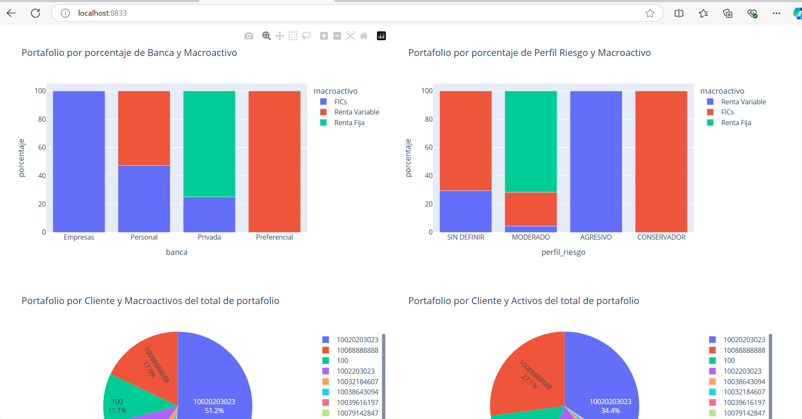
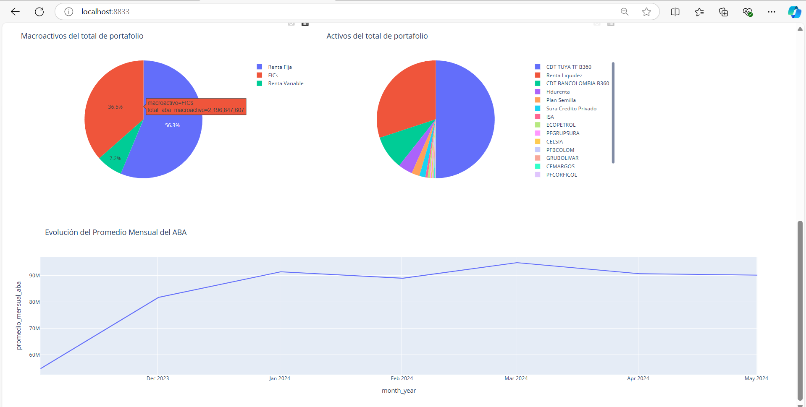

# Proyecto de Ingeniería de Datos

Este proyecto tiene como objetivo desarrollar un sistema de análisis de datos para gerentes comerciales de inversión. Proporciona herramientas analíticas para visualizar el portafolio de clientes, la evolución del ABA y más. La aplicación está construida con Dash, utilizando Flask como servidor, extrae la información desde archivos planos CSV y almacena los datos en una base de datos PostgreSQL.

## Contenidos
- [Requisitos Previos](#requisitos-previos)
- [Instalación](#instalación)
- [Configuración](#configuración)
- [Ejecución](#ejecución)
- [Imágenes de Ejemplo](#imágenes-de-ejemplo)

## Requisitos Previos

Antes de comenzar, asegúrate de tener instalado lo siguiente en tu máquina local:
- Docker
- Docker Compose

## Instalación

1. **Clonar el repositorio**:
   ```bash
   git clone https://github.com/juliozapatao96/etl-docker-tb-1.git
   ```

## Configuración

1. **Crear y activar la base de datos**:
   La base de datos `portafolio_inversiones` se creará automáticamente al iniciar el contenedor de PostgreSQL.


2. **Configurar el directorio de datos**:

   Crea un directorio `data` dentro de `etl-docker-tb-1`. Este directorio debe contener los archivos CSV que se utilizarán en el análisis.

 ```plaintext
   etl-docker-tb-1/
   ├── src/
   └── data/
   ...
 ```

3. **Actualizar variables de entorno en `config.env`**:

   Configura las credenciales de la base de datos en el archivo `config.env` ubicado en el directorio principal del proyecto dentro de la carpeta `config`:
   ```bash
   DB_NAME=portafolio_inversiones
   DB_USERNAME=postgres
   DB_PASSWORD=tu_contraseña
   DB_HOST=db
   DB_PORT=5432

## Ejecución

1. **Iniciar los contenedores**:
   Para iniciar la aplicación y la base de datos en Docker, ejecuta el siguiente comando en la terminal:
   ```bash
   docker-compose up -d

2. **Acceder a la aplicación**:
   Finalmente, en un navegador abre la aplicación con:
   ```bash
   http://localhost:8833/

3. **Acceder a pgAdmin (opcional)**: Puedes acceder a él en:
   ```bash
   http://localhost:8080/

## Imágenes de Ejemplo

A continuación se presentan algunas capturas de pantalla del dashboard:


*Visualización de datos con Dash-Plotly parte 1*


*Visualización de datos con Dash-Plotly parte 2*
